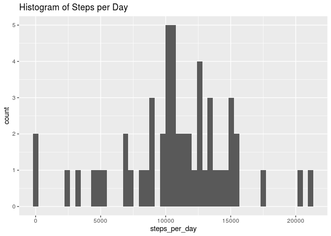
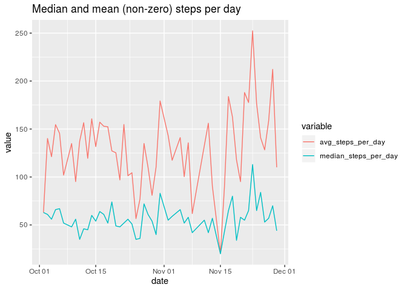
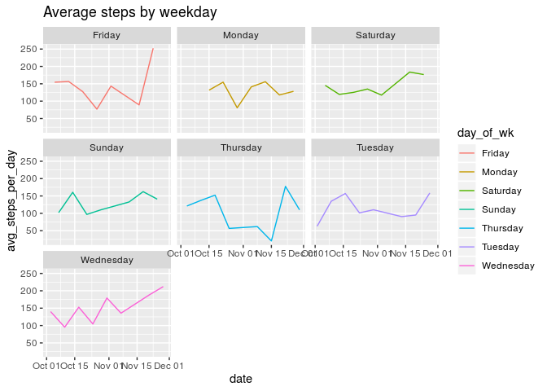

## **The Quantified Self Data**

### Vignette initialization

    Assignment conditions 1, 9


```r
#If not installed:
#install.packages("tidyverse")
#install.packages("data.table")

library(tidyverse)
library(data.table)
library(lubridate)
```

### Exploratory data analysis

    Assignment conditions 1, 2, 9


```r
data_raw <- fread("activity.csv")
head(data_raw)
```

```
##    steps       date interval
## 1:    NA 2012-10-01        0
## 2:    NA 2012-10-01        5
## 3:    NA 2012-10-01       10
## 4:    NA 2012-10-01       15
## 5:    NA 2012-10-01       20
## 6:    NA 2012-10-01       25
```

```r
str(data_raw)
```

```
## Classes 'data.table' and 'data.frame':	17568 obs. of  3 variables:
##  $ steps   : int  NA NA NA NA NA NA NA NA NA NA ...
##  $ date    : chr  "2012-10-01" "2012-10-01" "2012-10-01" "2012-10-01" ...
##  $ interval: int  0 5 10 15 20 25 30 35 40 45 ...
##  - attr(*, ".internal.selfref")=<externalptr>
```

```r
#Sample histogram of total steps taken each day (with out removing missing data)
```

- steps: Number of steps taking in a 5-minute interval (missing values are coded as \color{red}{\verb|NA|}NA)
- date: The date on which the measurement was taken in YYYY-MM-DD format
- interval: Identifier for the 5-minute interval in which measurement was taken

*source: assignment document*

### Tidying

    Assignment conditions 6, 9


```r
# Note, for the assignment, my strategy and method to analyze this data, is to only use complete observations, as seen in this code: (this code is meant to satisfy assignment condition 6.)
data_tidy <- data_raw %>% 
  mutate(date = as_date(date)) %>% 
  filter(complete.cases(.)) %>% 
  glimpse()
```

```
## Observations: 15,264
## Variables: 3
## $ steps    <int> 0, 0, 0, 0, 0, 0, 0, 0, 0, 0, 0, 0, 0, 0, 0, 0, 0, 0, 0, 0, …
## $ date     <date> 2012-10-02, 2012-10-02, 2012-10-02, 2012-10-02, 2012-10-02,…
## $ interval <int> 0, 5, 10, 15, 20, 25, 30, 35, 40, 45, 50, 55, 100, 105, 110,…
```

### Analysis

1. Steps taken each day

    Assignment conditions 7, 9


```r
total_steps_by_day <- data_tidy %>% 
  group_by(date) %>% 
  summarize(steps_per_day = sum(steps)) %>% 
  print()
```

```
## # A tibble: 53 x 2
##    date       steps_per_day
##    <date>             <int>
##  1 2012-10-02           126
##  2 2012-10-03         11352
##  3 2012-10-04         12116
##  4 2012-10-05         13294
##  5 2012-10-06         15420
##  6 2012-10-07         11015
##  7 2012-10-09         12811
##  8 2012-10-10          9900
##  9 2012-10-11         10304
## 10 2012-10-12         17382
## # … with 43 more rows
```

```r
total_steps_by_day_plot <- ggplot(total_steps_by_day, aes(x = steps_per_day))
total_steps_by_day_plot +
  geom_histogram(bins = nrow(total_steps_by_day)) + 
  labs(title = "Histogram of Steps per Day")
```

<!-- -->

2. Statistics of steps per day  

    Assignment conditions 3, 4, 9


```r
stats_for_steps_by_day <- data_tidy %>% 
  filter(steps > 0) %>% 
  group_by(date) %>% 
  summarize(avg_steps_per_day = mean(steps), median_steps_per_day = as.integer(median(steps))) %>% 
  print()
```

```
## # A tibble: 53 x 3
##    date       avg_steps_per_day median_steps_per_day
##    <date>                 <dbl>                <int>
##  1 2012-10-02              63                     63
##  2 2012-10-03             140.                    61
##  3 2012-10-04             121.                    56
##  4 2012-10-05             155.                    66
##  5 2012-10-06             145.                    67
##  6 2012-10-07             102.                    52
##  7 2012-10-09             135.                    48
##  8 2012-10-10              95.2                   56
##  9 2012-10-11             137.                    35
## 10 2012-10-12             157.                    46
## # … with 43 more rows
```

```r
long_form_stats_for_steps_by_day <- reshape2::melt(stats_for_steps_by_day, id = "date")

ggplot(data=long_form_stats_for_steps_by_day,
       aes(x=date, y=value, colour=variable)) +
       geom_line() +
       labs(title = "Median and mean (non-zero) steps per day")
```

<!-- -->

3. The 5 minute interval that on average 

    Assignment conditions 5, 9


```r
glimpse(stats_for_steps_by_day)
```

```
## Observations: 53
## Variables: 3
## $ date                 <date> 2012-10-02, 2012-10-03, 2012-10-04, 2012-10-05,…
## $ avg_steps_per_day    <dbl> 63.00000, 140.14815, 121.16000, 154.58140, 145.4…
## $ median_steps_per_day <int> 63, 61, 56, 66, 67, 52, 48, 56, 35, 46, 45, 60, …
```

```r
filter(stats_for_steps_by_day, avg_steps_per_day == max(avg_steps_per_day))
```

```
## # A tibble: 1 x 3
##   date       avg_steps_per_day median_steps_per_day
##   <date>                 <dbl>                <int>
## 1 2012-11-23              252.                  113
```

4. Panel plot comparing week days and weekend days

    Assignment conditions 8, 9


```r
stats_for_steps_by_days_of_week <- data_tidy %>% 
  filter(steps > 0) %>% 
  group_by(date) %>% 
  summarize(avg_steps_per_day = mean(steps)) %>% 
  group_by(day_of_wk = as.factor(weekdays(date))) %>% 
  print()
```

```
## # A tibble: 53 x 3
## # Groups:   day_of_wk [7]
##    date       avg_steps_per_day day_of_wk
##    <date>                 <dbl> <fct>    
##  1 2012-10-02              63   Tuesday  
##  2 2012-10-03             140.  Wednesday
##  3 2012-10-04             121.  Thursday 
##  4 2012-10-05             155.  Friday   
##  5 2012-10-06             145.  Saturday 
##  6 2012-10-07             102.  Sunday   
##  7 2012-10-09             135.  Tuesday  
##  8 2012-10-10              95.2 Wednesday
##  9 2012-10-11             137.  Thursday 
## 10 2012-10-12             157.  Friday   
## # … with 43 more rows
```

```r
wk_day_plot <- ggplot(data=stats_for_steps_by_days_of_week,
       aes(x=date, y=avg_steps_per_day, color = day_of_wk)) 

wk_day_plot +
  geom_line() +
  facet_wrap(vars(day_of_wk)) +
  labs(title = "Average steps by weekday")
```

<!-- -->


